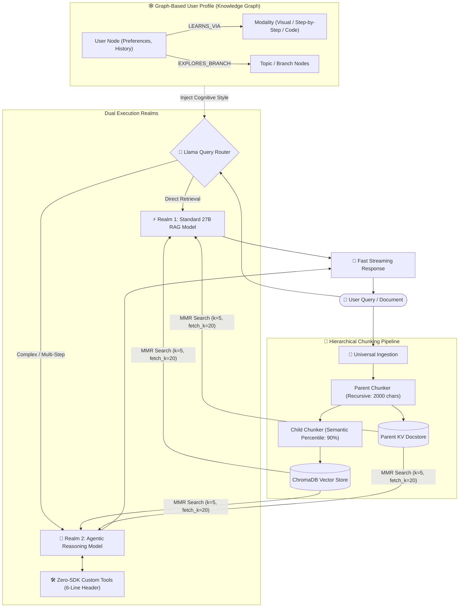
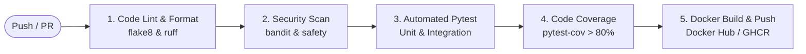

# 🧠 Study Pal: Adaptive Agentic RAG & Personalized Study Engine

[](https://fastapi.tiangolo.com/)
[](https://www.langchain.com/)
[](https://www.trychroma.com/)
[](#-containerization--deployment)
[](#-continuous-integration--continuous-deployment-cicd)
[](#-testing--pytest-suite)
[](#-production-grade-backend--security)
[](LICENSE)

An intelligent, production-ready **Personalized Study Agent & Advanced RAG System** designed to ingest documents in any format, build a dynamic graph-based cognitive profile of how you learn, and route queries between specialized RAG and reasoning agents.

---

## 🌟 Key Highlights

- **📄 Universal Ingestion**: Ingest PDFs, Markdown, plain text, and multiple document types seamlessly.
- **🧬 Advanced Parent-Child Chunking**: Combines high-level **Recursive Character Splitting** for large parent context retention with fine-grained **Semantic Chunking** for precise vector embeddings.
- **🎯 MMR-Based Retrieval**: Uses Maximal Marginal Relevance (`search_type="mmr"`) to maximize factual relevance while eliminating redundant chunks.
- **🕸️ Graph-Based User Cognitive Profiling**: Dynamically maps user learning patterns, preferred modalities (e.g., visual/image-driven explanations for math vs. code-first for programming), and mastery branches across a graph structure.
- **🔀 Intelligent Dual-Realm Router**: A smart Llama-based router dynamically determines query complexity:
  - **Realm 1 (Standard RAG)**: Fast, non-agentic 27B parameter RAG-specialized model for direct answers.
  - **Realm 2 (Agentic Reasoner)**: Powerful multi-step reasoning agent capable of plan execution and tool calling.
- **⚡ Zero-SDK 6-Line Tool Protocol**: Effortlessly define and plug in custom agent tools without bulky SDKs or complex configurations.
- **🔑 Google OAuth2 & Local Auth**: Secure authentication supporting traditional 12-round bcrypt hashed credentials and seamless Google Single Sign-On (SSO) login/sign-in.
- **🐳 Production Containerization**: Ready-to-deploy Docker and Docker-Compose setups with persistent volume orchestration.
- **🚀 Automated CI/CD Pipeline**: Multi-stage GitHub Actions workflows covering linting, security audits, unit/integration testing, and Docker builds.
- **🧪 Comprehensive Pytest Suite**: Full test coverage for authentication, rate limiters, vector search, and agent routing.

---

## 🏗️ System Architecture



---

## 🚀 Core Features Deep Dive

### 1. 🧬 Parent-Child Semantic + Recursive Chunking
Rather than losing global context with tiny chunks or degrading vector accuracy with giant chunks, the system implements a **two-tier hierarchical strategy**:
- **Parent Chunks (Recursive)**: Maintains broader context (2000 characters, 200 overlap) stored in a persistent key-value docstore.
- **Child Chunks (Semantic)**: Uses semantic chunking (`percentile` breakpoint threshold) to split text at natural topical shifts, generating precise vector embeddings.
- **MMR Retrieval**: Queries match child vectors with Maximal Marginal Relevance (`lambda_mult=0.5`), returning the complete rich parent document to the LLM.

### 2. 🕸️ Adaptive Graph-Based User Profiling
Every learner interacts differently. The system tracks and builds a graph profile of your learning behavior:
- **Concept Hierarchy**: Maps out prerequisite branches and sub-topics you explore.
- **Modal Preference Memory**: If you learn mathematical concepts best through visual representations/diagrams and computer science topics via code examples, the profile dynamically remembers this preference.
- **Personalized Recall**: Next time you study or revisit a concept, the retrieval and generation pipeline tailors explanations and formatting specifically to your cognitive profile.

### 3. 🔀 Intelligent Dual-Realm Router
A dedicated Llama-based router acts as the traffic controller:
| Realm | Model Category | Best For | Behavior |
| :--- | :--- | :--- | :--- |
| **Realm 1: Standard RAG** | ~27B RAG-Specialized Model | Fact lookups, definitions, direct document QA | Fast, cost-efficient, low-latency contextual generation |
| **Realm 2: Agentic Reasoner** | High-Reasoning Agent Model | Multi-step problem solving, math derivations, tool execution | Autonomous planning, iterative tool usage, structured verification |

### 4. 🛠️ Zero-SDK 6-Line Tool Protocol
Extend your agent's capabilities in seconds without importing external tool frameworks or boilerplate code. Simply write a Python function where the **first 6 lines of docstrings** define the tool metadata:

```python
# Tools/calculator.py
def calculate_expression(expression: str) -> str:
    """
    TOOL_NAME: Calculator
    DESCRIPTION: Evaluates mathematical expressions accurately.
    ARGUMENTS: expression (str) - The math expression to evaluate.
    EXAMPLE: calculate_expression("sqrt(144) + 25")
    OUTPUT: Formatted mathematical result string.
    """
    import math
    return str(eval(expression, {"__builtins__": None, "math": math}))
```
The agent dynamically parses the 6-line header, validates the schema, and registers the tool into its reasoning loop automatically.

### 5. 🔒 Production-Grade Backend, Security & Google SSO
- **FastAPI Core**: High-throughput asynchronous endpoints with token streaming (`StreamingResponse`).
- **Google OAuth2 Authentication (In Progress)**: Secure Google Identity SSO verification (`POST /auth/google`) converting verified Google ID tokens into internal JWT sessions while creating/linking the user's graph profile.
- **Local Authentication**: Passwords encrypted using `bcrypt` with 12 salt rounds before database persistence.
- **Stateless JWT Authentication**: Access tokens signed with HMAC-SHA256 (`HS256`), carrying timestamps and expiration policies.
- **Endpoint Rate Limiting**: Powered by `SlowAPI` with IP-based throttling (e.g., `5/min` for auth, `10/min` for generations).

---

## 🐳 Containerization & Deployment

The application is fully containerized for seamless deployment across local, staging, and production Kubernetes/Cloud environments.

### Dockerfile Architecture
```dockerfile
FROM python:3.11-slim AS builder

WORKDIR /app

# Install system dependencies
RUN apt-get update && apt-get install -y --no-install-recommends \
    build-essential \
    curl \
    && rm -rf /var/lib/apt/lists/*

COPY requirements.txt .
RUN pip install --no-cache-dir --upgrade pip && \
    pip install --no-cache-dir -r requirements.txt

# Production Stage
FROM python:3.11-slim

WORKDIR /app

COPY --from=builder /usr/local/lib/python3.11/site-packages /usr/local/lib/python3.11/site-packages
COPY --from=builder /usr/local/bin /usr/local/bin
COPY . /app

# Persistent volumes & security
RUN mkdir -p /app/data /app/persisted_parent_chunks /app/Documents
RUN useradd -m -u 1000 appuser && chown -R appuser:appuser /app
USER appuser

EXPOSE 8000

HEALTHCHECK --interval=30s --timeout=5s --start-period=10s --retries=3 \
  CMD curl -f http://localhost:8000/health || exit 1

CMD ["uvicorn", "Backend.main:app", "--host", "0.0.0.0", "--port", "8000"]
```

### Docker Compose Quickstart
Run the entire stack (FastAPI backend, Chroma storage, and persistent parent-doc store) with a single command:

```bash
# Build and start services in background
docker-compose up -d --build

# View container logs
docker-compose logs -f backend

# Stop services safely
docker-compose down
```

---

## 🚀 Continuous Integration & Continuous Deployment (CI/CD)

The repository features a modular GitHub Actions pipeline (`.github/workflows/ci-cd.yml`) ensuring high code quality, security standards, and automated deployment:



### GitHub Actions Pipeline Configuration
- **Linting & Code Quality**: Automated validation with `flake8` and `ruff` to catch syntax anomalies and enforce PEP-8 standards.
- **Security Auditing**: Scans codebase and third-party dependencies using `bandit` and `safety` for known vulnerabilities (CVEs).
- **Automated Test Matrix**: Runs tests across multiple Python versions (`3.10`, `3.11`) with in-memory SQLite and mock vector embeddings.
- **Container Registry Push**: Automated tagging and publishing of multi-arch Docker images on successful `main` branch merges.

---

## 🧪 Testing & Pytest Suite

A comprehensive test suite is structured inside the `Test/` directory to validate every layer of the system:

```plaintext
Test/
├── conftest.py               # Shared pytest fixtures, TestClient & mock DB
├── test_auth.py              # Bcrypt hashing, JWT generation & Google SSO verification
├── test_rate_limiter.py      # SlowAPI request throttling & rate limit headers
├── test_rag_ingestion.py     # Universal file loader & parent-child chunking
├── test_rag_retrieval.py     # MMR vector search & parent document resolution
└── test_router_agent.py      # Llama query router classification & tool executions
```

### Running Pytest Locally

```bash
# Run all tests with verbosity
pytest -v

# Run with test coverage report
pytest --cov=Backend --cov=Rag --cov-report=term-missing

# Run specific authentication test suite
pytest Test/test_auth.py -v
```

---

## 📁 Repository Structure

```plaintext
Advance_RAG_SYSTEM/
├── .github/
│   └── workflows/
│       └── ci-cd.yml        # CI/CD pipeline (Lint, Security, Pytest, Docker)
├── Backend/
│   ├── main.py              # FastAPI application & route declarations
│   ├── security.py          # Bcrypt hashing, JWT tokens & Google OAuth2 SSO
│   ├── dependencies.py      # Auth guards & token validation dependencies
│   ├── config.py            # Pydantic schemas (Rag, Auth, GoogleAuth)
│   └── database.py          # SQLite database connection & user persistence
├── Rag/
│   ├── Ingestion.py         # Universal loader, Semantic & Recursive splitters
│   ├── Retrival.py          # MMR retrieval pipeline & streaming LLM chains
│   ├── Query_router.py      # Llama-based query classification & routing
│   ├── Query_writer.py      # Query rewriting & structure refinement
│   ├── Agentic_Rag.py       # Multi-step reasoning agent with tool execution
│   └── Evaluation.py        # RAG evaluation metrics & benchmarks
├── Tools/                   # Zero-SDK plug-and-play tools (6-line protocol)
├── Documents/               # Ingested PDF, TXT, and Markdown files
├── data/                    # ChromaDB vector store persistent storage
├── Test/                    # Pytest test suite (Auth, RAG, Rate limits)
├── user_profile.cypher      # Knowledge graph schema & profile seed queries
├── Frontend/                # Web UI interface
├── Dockerfile               # Multi-stage container definition
├── docker-compose.yml       # Production container orchestration
├── requirements.txt         # Production dependencies
└── README.md                # Project documentation
```

---

## ⚙️ Getting Started

### 1. Prerequisites
- Python 3.10+
- Virtual environment tool (`venv` or `conda`)
- Docker & Docker Compose (Optional for containerized run)

### 2. Local Installation

```bash
git clone https://github.com/Uwais-ML/Study_Pal.git
cd Study_Pal

python3 -m venv venv
source venv/bin/activate  # On Windows: venv\Scripts\activate
pip install -r requirements.txt
```

### 3. Environment Configuration

Create a `.env` file in the root directory:
```env
# LLM & Embedding Credentials
GROQ_API_KEY=your_groq_or_model_api_key
GROQ_API_BASE=https://api.groq.com/openai/v1
OPENAI_API_KEY=your_openai_api_key

# Security & Authentication
JWT_SECRET=your_super_secret_jwt_key_here
ALGORITHM=HS256

# Google OAuth2 Credentials (In Progress)
GOOGLE_CLIENT_ID=your_google_client_id.apps.googleusercontent.com
GOOGLE_CLIENT_SECRET=your_google_client_secret

# Database & Graph Settings (Optional / Neo4j)
NEO4J_URI=bolt://localhost:7687
NEO4J_USER=neo4j
NEO4J_PASSWORD=your_password
```

### 4. Running the Backend Server

Start the FastAPI application with Uvicorn:
```bash
uvicorn Backend.main:app --reload --host 0.0.0.0 --port 8000
```

Access the interactive API documentation at:
- Swagger UI: `http://localhost:8000/docs`
- ReDoc: `http://localhost:8000/redoc`

---

## 📡 API Endpoints

| Method | Endpoint | Description | Rate Limit | Status |
| :--- | :--- | :--- | :--- | :--- |
| `GET` | `/health` | Service health & liveness check | 5 / minute | Active |
| `POST` | `/Signin` | Register a new user with bcrypt-hashed credentials | 5 / minute | Active |
| `POST` | `/login` | Authenticate local user & obtain Bearer JWT token | 5 / minute | Active |
| `POST` | `/auth/google` | Google OAuth2 SSO verification & token generation | 5 / minute | In Progress |
| `POST` | `/generate` | Stream RAG responses with MMR context & user profile | 10 / minute | Active |

---

## 🧪 Evaluation & Benchmarking

Run the evaluation module to assess context relevance, groundedness, and answer faithfulness:
```bash
python Rag/Evaluation.py
```

---

## 🗺️ Project Roadmap

- [x] Universal multi-format file ingestion (PDF, TXT, MD)
- [x] Hierarchical Parent-Child chunking (Semantic + Recursive)
- [x] MMR-based vector retrieval with ChromaDB
- [x] Dual-Realm Llama Query Router
- [x] Zero-SDK 6-line custom tool protocol
- [x] Knowledge Graph cognitive profiling (User learning style memory)
- [x] Bcrypt + JWT authentication & SlowAPI rate limiting
- [ ] **Google OAuth2 SSO Integration** *(In Progress)*
- [ ] **Containerization & Dockerfile deployment** *(In Progress)*
- [ ] **Automated GitHub Actions CI/CD Pipeline** *(In Progress)*
- [ ] **End-to-End Pytest testing suite** *(In Progress)*

---

## 🤝 Contributing

Contributions, issues, and feature requests are welcome! Feel free to check the issues page or submit a pull request.

---

## 📄 License

This project is licensed under the MIT License.
