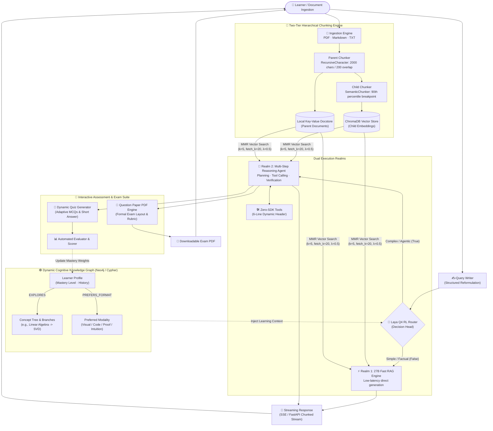

# 🧠 Study Pal: Next-Generation Adaptive Agentic RAG & Cognitive Study Engine

[](https://python.org)
[](https://fastapi.tiangolo.com/)
[](https://www.langchain.com/)
[](https://www.trychroma.com/)
[-7B1FA2.svg?style=flat)](Models/)
[](#7-interactive-quizzes-scoring--question-paper-pdf-generation)
[](#-containerization--cloud-deployment)
[](#-hardened-enterprise-security)
[](LICENSE)

> **Study Pal** is a state-of-the-art, cognitive-adaptive Retrieval-Augmented Generation (RAG) platform. By unifying **hierarchical semantic parent-child chunking**, **Maximal Marginal Relevance (MMR)** retrieval, **graph-based learner profiling**, **interactive quiz generation with automated scoring**, **PDF question paper compilation**, and edge-optimized **Laya RL routing**, Study Pal delivers hyper-personalized, contextually grounded study assistance with dual-realm execution.

---

## 📑 Table of Contents
- [Executive Overview](#-executive-overview)
- [System Architecture](#-system-architecture)
- [Deep Dive: Core Innovations](#-deep-dive-core-innovations)
  - [1. Two-Tier Hierarchical Chunking (Parent-Child)](#1-two-tier-hierarchical-chunking-parent-child)
  - [2. Maximal Marginal Relevance (MMR) Retrieval](#2-maximal-marginal-relevance-mmr-retrieval)
  - [3. Cognitive Learner Profiling & Visual Knowledge Graph](#3-cognitive-learner-profiling--visual-knowledge-graph)
  - [4. Laya Q4 Intelligent Router & Self-Deciding Agent (Hands-Free Dual Realm)](#4-laya-q4-intelligent-router--self-deciding-agent-hands-free-dual-realm)
  - [5. Zero-SDK 6-Line Tool Protocol](#5-zero-sdk-6-line-tool-protocol)
  - [6. Quantitative Evaluation & Groundedness Auditing](#6-quantitative-evaluation--groundedness-auditing)
  - [7. Interactive Quizzes, Scoring & Question Paper PDF Generation](#7-interactive-quizzes-scoring--question-paper-pdf-generation)
- [Hardened Enterprise Security](#-hardened-enterprise-security)
- [Repository Anatomy](#-repository-anatomy)
- [Getting Started](#-getting-started)
- [API Reference](#-api-reference)
- [Extending Custom Tools](#-extending-custom-tools)
- [Containerization & Cloud Deployment](#-containerization--cloud-deployment)
- [Roadmap & Milestones](#-roadmap--milestones)

---

## 💎 Executive Overview

Traditional RAG systems suffer from three fundamental bottlenecks:
1. **The Context Dilemma**: Small chunks provide precise vector embeddings but lose surrounding document context; large chunks preserve context but dilute retrieval precision.
2. **One-Size-Fits-All Explanations & Passive Learning**: Generic LLMs ignore how individual learners assimilate concepts (e.g., visual learners vs. formal symbolic thinkers) and fail to actively verify understanding through structured examination.
3. **Monolithic Compute Waste**: Routing every trivial fact lookup into high-latency, multi-step agent reasoning loops spikes operational cost and latency.

**Study Pal solves all three with zero user overhead:**
- **Zero Effort for the User (100% Autonomous)**: The user does not need to choose modes, configure models, or toggle tools. You simply ask a question or upload study notes.
- **Self-Deciding Orchestration**: The **Laya Router** instantly decides whether the request is simple or agentic. Plain RAG serves instant factual answers; the **Agentic Model itself autonomously decides** the execution plan, which tools to trigger, when to generate quizzes or exam PDFs, and how to adapt explanations to your learning graph.
- **Hierarchical Parent-Child Retrieval**: Indexes fine-grained semantic child vectors while injecting full, rich parent contexts into the prompt.
- **Cognitive Graph Profiler**: Constructs a dynamic knowledge graph modeling learner mastery, prerequisites, and sensory preferences (visual diagrams vs. code vs. derivations).
- **Active Diagnostic Examination**: Dynamically generates interactive quizzes, grades and scores student responses with actionable diagnostic feedback, and exports ready-to-print **Question Paper PDFs** complete with rubrics and answer keys.

> [!TIP]
> **Simplicity First**: The user does nothing manual. The Laya Router, Plain RAG, and the Self-Deciding Agentic Model handle the entire cognitive workflow autonomously behind the scenes.

---

## 🏗️ System Architecture



---

## 🔬 Deep Dive: Core Innovations

### 1. Two-Tier Hierarchical Chunking (Parent-Child)
Standard chunking forces an engineering compromise: vector matching needs short sentences, but generation needs entire paragraphs. Study Pal eliminates this trade-off:
- **Parent Generation Chunks**: The document is partitioned into large, cohesive context envelopes (2,000 characters with 200-character overlap) via `RecursiveCharacterTextSplitter` and stored in persistent key-value docstores.
- **Child Vector Chunks**: Each parent chunk is subdivided using `SemanticChunker` (`breakpoint_threshold_type="percentile"`, threshold `90`). Splitting occurs strictly where embedding distance diverges significantly.
- **Parent Resolution**: At query time, vector similarity matches the child, but the system dynamically resolves and feeds the entire parent document into the LLM context.

```python
# Rag/Ingestion.py
retriever = ParentDocumentRetriever(
    vectorstore=self.vecstore,
    docstore=self.store,
    child_splitter=self.semantic,   # Semantic percentile chunker
    parent_splitter=self.recursive, # 2000-char recursive parent splitter
    search_type="mmr",
    search_kwargs={"k": 5, "fetch_k": 20, "lambda_mult": 0.5}
)
```

### 2. Maximal Marginal Relevance (MMR) Retrieval
Standard top-k cosine similarity frequently retrieves redundant or nearly identical passages. Study Pal incorporates **MMR search**:
$$\text{MMR} = \arg\max_{D_i \in R \setminus S} \left[ \lambda \cdot \text{Sim}_1(D_i, Q) - (1 - \lambda) \max_{D_j \in S} \text{Sim}_2(D_i, D_j) \right]$$
- Fetches `fetch_k = 20` candidates.
- Balances semantic relevance ($\lambda = 0.5$) with chunk diversity to produce high-signal, non-redundant contextual grounding.

### 3. Cognitive Learner Profiling & Visual Knowledge Graph
Every student learns differently. Study Pal incorporates an explicit graph ontology (`user_profile.cypher`) that models and visually renders the user's cognitive trajectory:
- **Visual Concept & Prerequisite Graphs**: Generates interactive graph maps of the student's learning path. Each node represents a distinct concept (e.g., `Calculus` $\rightarrow$ `Partial Derivatives` $\rightarrow$ `Gradient Descent`) color-coded by mastery percentage (Green for Mastered $>80\%$, Amber for In-Progress, Red for Weak Areas requiring targeted drills).
- **Domain Modality Memory**: Dynamically discovers, stores, and graphs how the user learns across domains:
  - If a user excels when mathematics is explained via **spatial diagrams & visual analogies**, the graph tags `(User)-[:PREFERS {modality: 'visual'}]->(Topic:Mathematics)`.
  - If the user prefers **raw code implementations** for algorithms, explanations automatically pivot to code-first walkthroughs.
- **Interactive Learner Analytics Dashboard**: Visualizes mastery retention curves, topic prerequisite dependencies, and diagnostic study recommendations directly in the web UI.
- **Adaptive Memory Recall**: Subsequent queries cross-reference the cognitive graph to bias both retrieval filters and prompt generation.

### 4. Laya Q4 Intelligent Router & Self-Deciding Agent (Hands-Free Dual Realm)
The user has to do **absolutely nothing**—no mode toggling, no manual model switching, and no prompt tuning. Simply ask a question or drop documents. The **Laya Router** and the **Agentic Model** autonomously handle the entire decision-making lifecycle:

| Execution Realm | Core Engine | Latency | Target Workload & Autonomous Behavior |
| :--- | :--- | :--- | :--- |
| **Realm 1: Plain Direct RAG** | ~27B Parameter Specialized RAG Model | Low (~200ms) | Direct definitions, factual QA, summary extraction. Handled instantly without tool overhead. |
| **Realm 2: Agentic Reasoner** | Autonomous Multi-Step Reasoning Agent | Dynamic | Complex derivations, multi-step problem solving, code execution, automated quiz/exam generation. |

- **Hands-Free Routing**: Powered by [Rag/Query_router.py](file:///Users/apple/Advance_RAG_SYSTEM/Rag/Query_router.py) with the local `Models/laya-Q4_K_M.gguf` runtime and decision head tensors (`laya-head.safetensors`).
- **The Agentic Model Itself Decides**: Once routed to Realm 2, the user doesn't specify tools or execution flows. The agent autonomously:
  1. Breaks down the problem into logical reasoning steps.
  2. Dynamically discovers and triggers custom tools (from the zero-SDK `Tools/` registry).
  3. Checks the user's cognitive profile to format explanations using preferred modalities (e.g., rendering diagrams for visual learners).
  4. Decides whether to generate practice quizzes or compile printable Question Paper PDFs.
  5. Evaluates and scores student answers without requiring any user setup.

### 5. Zero-SDK 6-Line Tool Protocol
Engineers and students can plug arbitrary tools into the agent runtime without installing heavyweight SDKs, writing decorators, or managing external registries. 

Simply define a Python function where the **first 6 lines of docstrings** specify the tool contract:

```python
# Tools/matrix_solver.py
def solve_eigenvalues(matrix_json: str) -> str:
    """
    TOOL_NAME: MatrixSolver
    DESCRIPTION: Computes eigenvalues and eigenvectors of an NxN numeric matrix.
    ARGUMENTS: matrix_json (str) - JSON string representing 2D square matrix.
    EXAMPLE: solve_eigenvalues("[[2, 0], [0, 3]]")
    OUTPUT: Formatted eigenvalues and eigenvectors.
    """
    import json, numpy as np
    mat = np.array(json.loads(matrix_json))
    w, v = np.linalg.eig(mat)
    return f"Eigenvalues: {w.tolist()}\nEigenvectors: {v.tolist()}"
```
The agent inspects the 6-line header, validates argument signatures, and exposes the tool to the reasoner loop dynamically.

### 6. Quantitative Evaluation & Groundedness Auditing
Built-in evaluation benchmarking in [Rag/Evaluation.py](file:///Users/apple/Advance_RAG_SYSTEM/Rag/Evaluation.py) continuously measures pipeline quality across critical metrics:
- **Token-Level $F_1$ Score**: Measures precision and recall between generated answers and ground truth.
- **Sequence Alignment Similarity**: Sequence matcher assessing lexical preservation.
- **Context Groundedness & Faithfulness**: Verifies whether model claims are supported by retrieved parent chunks, preventing hallucinations.

### 7. Interactive Quizzes, Scoring & Question Paper PDF Generation
Study Pal transforms passive reading into active, mastery-driven learning through an integrated assessment engine:

- **🎯 Interactive Adaptive Quizzes**:
  - Automatically synthesizes conceptual, numerical, and multiple-choice quizzes tailored to the learner's current branch in the knowledge graph.
  - Dynamically modulates difficulty levels based on past performance.
- **📊 Automated Grading & Real-Time Scoring**:
  - Evaluates student answers, calculates percentage scores, and provides step-by-step diagnostic feedback pinpointing misconceptions.
  - Feeds performance metrics directly back into the **Learner Profile Graph**, updating concept mastery weights and scheduling targeted revisions for weak areas.
- **📄 Printable Question Paper PDF Generation**:
  - Compiles comprehensive, professionally structured exam papers directly from ingested course documents.
  - Formats university-style question papers with exam headers, sections (Section A: Multiple Choice, Section B: Short Questions, Section C: Analytical Problems), time limits, and mark breakdowns.
  - Generates downloadable, publication-grade **PDF question papers** accompanied by separate grading rubrics and complete solution keys.

---

## 🔒 Hardened Enterprise Security

- **FastAPI Core & Streaming**: Non-blocking asynchronous token generation over `StreamingResponse`.
- **Stateless Bearer JWT Auth**: Cryptographically signed HMAC-SHA256 tokens with configurable expirations and payload claims.
- **Bcrypt Hashing**: 12 salt rounds protecting user credentials prior to SQLite persistence.
- **SlowAPI Rate Limiting**: Endpoint-specific token-bucket throttling (`5/min` on auth, `10/min` on generation) defending against brute-force attacks and compute exhaustion.
- **Safe Secrets Management**: Strictly isolated `.env` configurations protected by `.gitignore` rules.

---

## 📁 Repository Anatomy

```plaintext
Advance_RAG_SYSTEM/
├── Backend/
│   ├── main.py              # FastAPI application, streaming routes & rate limiting
│   ├── security.py          # Bcrypt 12-round hashing & JWT token issuance
│   ├── dependencies.py      # OAuth2 bearer authentication guards
│   ├── config.py            # Pydantic schemas (Rag, Auth)
│   └── database.py          # SQLite database connection & command executor
├── Rag/
│   ├── Ingestion.py         # Universal loader, Semantic & Recursive splitters
│   ├── Retrival.py          # MMR retrieval pipeline & streaming LLM chains
│   ├── Query_router.py      # Laya-powered intelligent agent router
│   ├── Query_writer.py      # Structured query reformulation engine
│   ├── Agentic_Rag.py       # Multi-step reasoning agent with tool orchestration
│   └── Evaluation.py        # Token F1, similarity & groundedness evaluation suite
├── Models/
│   ├── laya-Q4_K_M.gguf     # 4-bit quantized Laya backbone model (~260 MB)
│   ├── laya-head.safetensors# Native RL decision head weights (36 tensors)
│   ├── laya_head.py         # Native safetensors head loader
│   ├── tokenizer.json       # ModernBERT vocabulary & tokenizer
│   └── rl_agent_config.json # Escalation thresholds & routing temperatures
├── Tools/                   # Zero-SDK plug-and-play custom tool repository
├── Documents/               # Ingested PDF, Markdown, and TXT files
├── data/                    # ChromaDB persistent vector database
├── user_profile.cypher      # Knowledge graph schema & profile seed queries
├── Frontend/
│   ├── index.html           # Interactive Study Pal user interface
│   ├── parser.js            # Streaming markdown renderer & client logic
│   └── style.css            # Modern glassmorphism UI styling
├── Dockerfile               # Multi-stage production container blueprint
├── docker-compose.yml       # Production orchestration with healthchecks
├── requirements.txt         # Production dependencies
└── README.md                # System documentation
```

---

## 🚀 Getting Started

### 1. Prerequisites
- Python 3.10 or 3.11
- Git & Virtualenv

### 2. Quickstart Installation
```bash
# Clone the repository
git clone https://github.com/Uwais-ML/Study_Pal.git
cd Study_Pal

# Initialize virtual environment
python3 -m venv venv
source venv/bin/activate  # On Windows: venv\Scripts\activate

# Install dependencies
pip install -r requirements.txt
```

### 3. Environment Setup
Configure your credentials in `.env`:
```env
# LLM & Embedding API Keys
GROQ_API_KEY="your-groq-api-key"
GROQ_API_BASE="https://api.groq.com/openai/v1"
OPENAI_API_KEY="your-openai-api-key"

# Security & Tokens
JWT_SECRET="your-super-secure-jwt-secret"
ALGORITHM="HS256"

# Optional Knowledge Graph (Neo4j)
NEO4J_URI="bolt://localhost:7687"
NEO4J_USER="neo4j"
NEO4J_PASSWORD="password"
```

### 4. Running the Application
```bash
# Start the backend server
uvicorn Backend.main:app --reload --host 0.0.0.0 --port 8000
```
- Interactive Swagger UI: `http://localhost:8000/docs`
- Redoc Documentation: `http://localhost:8000/redoc`

---

## 📡 API Reference

| Method | Endpoint | Description | Rate Limit | Auth Required |
| :--- | :--- | :--- | :--- | :--- |
| `GET` | `/health` | Service liveness & health check | 5 / minute | No |
| `POST` | `/Signin` | Create a new user with 12-round bcrypt hash | 5 / minute | No |
| `POST` | `/login` | Authenticate and obtain JWT Bearer token | 5 / minute | No |
| `POST` | `/generate` | Stream RAG / Agent response via SSE | 10 / minute | Yes (Bearer) |
| `POST` | `/quiz/generate` | Generate interactive topic quiz | 10 / minute | Yes (Bearer) |
| `POST` | `/quiz/evaluate` | Grade student answers & update cognitive graph | 10 / minute | Yes (Bearer) |
| `POST` | `/exam/export-pdf` | Generate & download structured Question Paper PDF | 5 / minute | Yes (Bearer) |

---

## 🐳 Containerization & Cloud Deployment

Study Pal provides an optimized multi-stage `Dockerfile` and `docker-compose.yml` for reproducible production deployments:

```bash
# Build and run containers in detached mode
docker-compose up -d --build

# Monitor streaming backend logs
docker-compose logs -f backend

# Tear down gracefully
docker-compose down
```

---

## 🗺️ Roadmap & Milestones

- [x] Universal multi-format file ingestion (PDF, Markdown, TXT)
- [x] Hierarchical parent-child chunking (Recursive parent + Semantic child)
- [x] Maximal Marginal Relevance (MMR) retrieval engine
- [x] Integration of local 4-bit **Laya RL Router**
- [x] Zero-SDK 6-line custom tool protocol
- [x] Graph-based cognitive learner profiling schema
- [x] Interactive quiz generator with automated grading and scoring
- [x] Automated Question Paper PDF export engine
- [x] Bcrypt + JWT authentication & SlowAPI rate limiting
- [ ] **Google OAuth2 SSO Integration** *(In Progress)*
- [ ] **Automated GitHub Actions CI/CD Pipeline** *(In Progress)*
- [ ] **End-to-End Pytest Testing Suite** *(In Progress)*

---

## 🤝 Contributing & Community

Contributions are welcomed! Whether you are optimizing chunking strategies, adding zero-SDK tools, or expanding learner ontology graphs:
1. Fork the Project
2. Create your Feature Branch (`git checkout -b feature/CognitiveImprovement`)
3. Commit your Changes (`git commit -m 'feat: Add cognitive memory layer'`)
4. Push to the Branch (`git push origin feature/CognitiveImprovement`)
5. Open a Pull Request

---

## 📄 License

Distributed under the MIT License. See `LICENSE` for more information.
